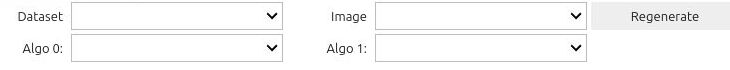
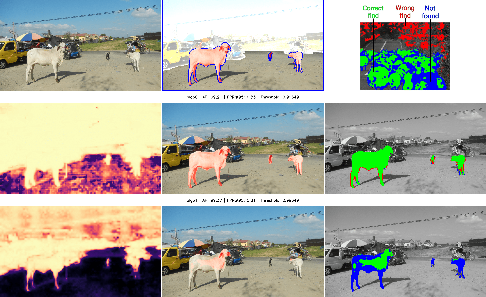

# Interactive interface for visualisation of anomaly detection methods 🚙🛣️🐖💥

## Project Setup

To set up and run this project on your local machine, follow the steps below.
1. ```bash
   git clone https://github.com/VitekKvitek/widgets-CVUT
2. ```bash
   cd widgets-CVUT
3. ```bash
   python3 -m venv venv
4. ```bash
   source venv/bin/activate
5. ```bash
   pip3 install -r requirements.txt
## Running the app
Go to the directory in which you stored the project and use theese commands
1. ```bash
   source venv/bin/activate
2. ```bash
   pip3 install -r requirements.txt
3. ```bash
   voila main_widget.ipynb
Then in internet browser go to ``http://localhost:8866/`` 
## Importing data
* replace **data** folder with own data containing **export/** **dataset**, **result**, **config.json**
  
## How to use
1. Select algorithm to compare from **Algo0** and **Algo1** dropdown menus
2. Select folder in **Dataset** dropdown
3. Chose file from **Image** dropdown to be displayed
4. Press **Regenerate** for change to be displayed



## Image Output

## Key technologies used
This project is built with **ipywidgets** and it runs in **jupyternotebook**

## Citation
If you use this work please cite:
```latex
@InProceedings{Widget🚙🛣️🐖💥,
    author    = {Petřík, Jiří Procházka, Vítězslav and Vojíř, Tomáš},
    title     = {{Interactive interface for visualisation of anomaly detection methods}},
    year      = {2024},
}
```
## Support
It works on my machine ❤️

## Support
It works on my machine ❤️
## Totally real life scenario


